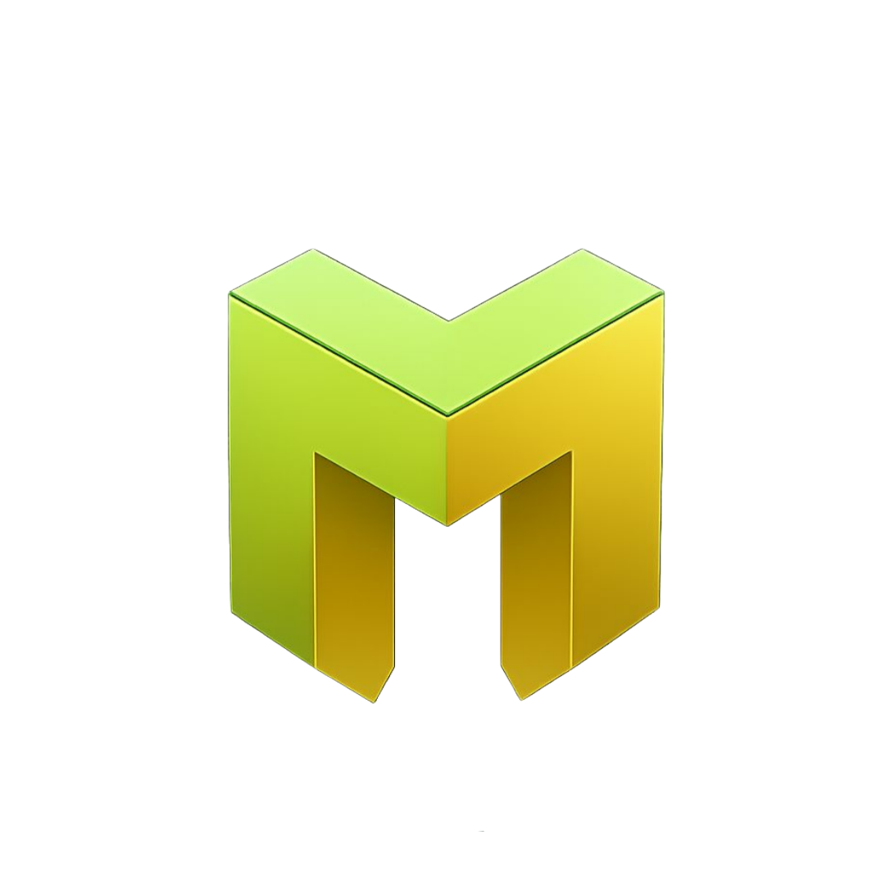
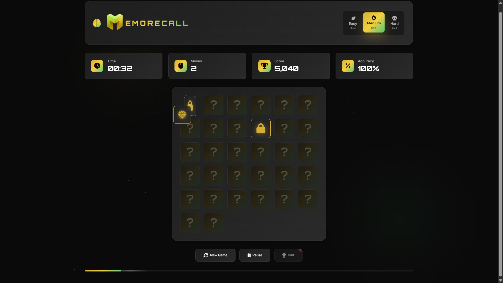

<div align="center"></div>

# <div align="center">MEMORECALL</div>

**Memorecall** is a premium web-based memory card game offering a stylish, highly customisable, and functional user experience.

---

## 🚀 Live Demo

Experience Memorecall live here: 
👉 [](https://eccentriccoder01.github.io/Memorecall)

 <div align="center">
 <p>

[](https://github.com/ellerbrock/open-source-badges/)


 </p>
 </div>

## 📸 Screenshots

<div align="center"></div>

---

### 💡 Core Features

* **Memory Matching:** Players click on cards to reveal their hidden icons and find matching pairs.
* **Dynamic Board Generation:** The game board is dynamically generated based on the selected difficulty, ensuring a fresh layout with each new game.
* **Flip Mechanics:** Cards smoothly flip with a 3D rotation effect to reveal their faces.
* **Match and Mismatch Visuals:**
    * **Match:** Matched cards remain face-up and subtly fade out, accompanied by a "sparkle" effect.
    * **Mismatch:** Mismatched cards automatically flip back after a short delay, with a "shake" animation to indicate an incorrect guess.
* **Real-time Timer:** Tracks the elapsed time during gameplay.
* **Moves Counter:** Records the total number of attempts made to find pairs.
* **Dynamic Score:** Calculates and displays the player's score based on matched pairs, time taken, and moves.
* **Accuracy Tracker:** Shows the percentage of correct matches out of total attempts.
* **Progress Bar:** A visual indicator at the bottom of the screen that updates to show the completion percentage of the game as pairs are matched.
* **Difficulty Selection:** Players can choose between Easy (4x4), Medium (6x6), and Hard (8x8) difficulties, which adjusts the board size and the number of pairs.
* **New Game Button:** Instantly restarts the game with a new set of shuffled cards.
* **Pause/Resume Functionality:** Allows players to pause the game at any time, halting the timer and providing a pause modal.
* **Hint System:** Players have a limited number of hints (3 by default) that can be used to briefly reveal an unmatched pair.
* **Keyboard Shortcuts:** Enhances usability with shortcuts for New Game ('N'), Pause/Resume ('Spacebar'), and Hint ('H').
* **Victory Modal:** Appears upon game completion, displaying final statistics such as time, moves, score, and a star rating. It also includes "Play Again" and "Close" options.
* **Pause Modal:** A clear overlay indicating the game is paused, with options to resume or restart.

### 🎨 User Interface & Experience

* **Premium Aesthetic & UI/UX:** The game boasts a sophisticated design with a dark theme, golden accents, and carefully crafted animations. The use of `linear-gradient` and `radial-gradient` for backgrounds and text, along with subtle `box-shadow` effects, contributes to a luxurious feel.
* **Smooth CSS Animations & Transitions:**
    * **Card Flipping:** Utilizes `transform: rotateY` for a realistic 3D flip animation, managed by the `.card-inner` container to prevent layout shifts.
    * **Hover Effects:** Interactive elements like difficulty buttons, stat cards, and control buttons include smooth hover transitions for a polished feel.
    * **Dynamic Backgrounds:** Features "floating particles" and "gradient orbs" that animate in the background, adding a dynamic and immersive visual layer.
    * **Sparkle and Shake Effects:** Visual feedback for matches (sparkles) and mismatches (shakes) enhances the player experience.
    * **Progress Bar Shimmer:** A `shimmer` animation on the progress bar provides an extra touch of visual flair.
* **Responsive Design:** The layout adapts gracefully to different screen sizes, ensuring a consistent and enjoyable experience on desktops, tablets, and mobile devices.
* **Interactive Modals:** Victory and pause modals are not just static overlays; they include subtle animations (`scale` and `translateY` transitions) that make their appearance and disappearance smooth and engaging.
* **Accessibility Enhancements:** Includes keyboard navigation shortcuts, offering an alternative control method beyond just mouse clicks.

---

## 🛠️ Technology Stack

Memorecall is built using a standard web development stack, focusing on client-side technologies for a rich interactive experience.


---

## ⚙️ Setup Instructions

To run Memorecall:

### 1. Clone the Repository

```bash
git clone [https://github.com/eccentriccoder01/Memorecall.git](https://github.com/eccentriccoder01/Memorecall.git)
cd Memorecall
````

### 2\. Install Dependencies

Each folder (`js`, `styles`, `favicon`, etc.) is client-side. You can serve the project using any local server (e.g. `Live Server` in VSCode or Python's HTTP server):

```bash
npx live-server .
```
---

## Issue Creation ✴

Report bugs and issues or propose improvements through our GitHub repository's "Issues" tab.

## Contribution Guidelines 📑

- Firstly Star(⭐) the Repository
- Fork the Repository and create a new branch for any updates/changes/issue you are working on.
- Start Coding and do changes.
- Commit your changes
- Create a Pull Request which will be reviewed and suggestions would be added to improve it.
- Add Screenshots and updated website links to help us understand what changes is all about.

- Check the [CONTRIBUTING.md](CONTRIBUTING.md) for detailed steps...

## Contributing is fun🧡

We welcome all contributions and suggestions!
Whether it's a new feature, design improvement, or a bug fix - your voice matters 💜

Your insights are invaluable to us. Reach out to us team for any inquiries, feedback, or concerns.

## 📄 License

This project is open-source and available under the MIT License.

## 📞 Contact

Developed by [Eccentric Explorer](https://eccentriccoder01.github.io/Me)

Feel free to reach out with any questions or feedback\!